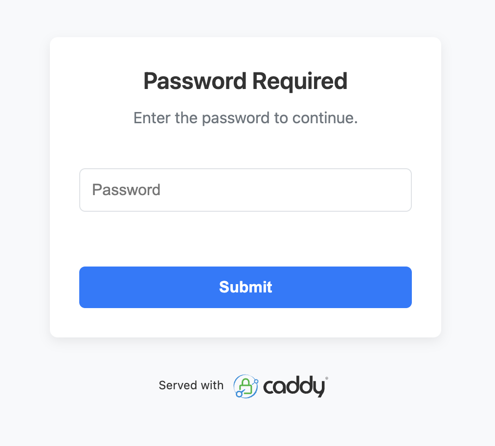

# Caddy Simple Password

A [Caddy](https://caddyserver.com) HTTP handler module that protects routes with a single shared password. Sessions are persisted via a hashed-password cookie so users are not re-prompted on every request.

> **Note:** This code was vibe-coded with AI assistance and reviewed by a human.

<p align="center">
  
</p>

## Building

To build Caddy with this module, use xcaddy:

```bash
xcaddy build --with github.com/xupefei/caddy-simple-password
```

## Example Caddyfile

```caddyfile
:8080 {
    handle /private/* {
        simple_password {
            password {env.MY_SECRET}
            session_inactivity_timeout 24h
            cookie_path /private
        }

        respond "You're in!"
    }
}
```

## Configuration Options

| Directive | Description | Default |
|---|---|---|
| `password` | The shared password. Supports Caddy placeholders like `{env.PASSWORD}` or `{file./path/to/password.txt}`. | *(required)* |
| `session_inactivity_timeout` | How long a session lasts before re-prompting. Uses Go duration syntax (`30m`, `2h`, `168h` for 7 days, `8760h` for 1 year). | `60m` |
| `cookie_name` | Name of the session cookie. | `sp_sess` |
| `cookie_path` | Path scope for the session cookie. | `/` |
| `cookie_domain` | Domain scope for the session cookie. | *(unset)* |
| `form_template` | Path to a custom HTML template for the password form. | embedded default |

## How It Works

1. On first visit, the user sees a password form.
2. On correct password submission, a cookie is set with the value `hex(SHA256(password))` and `Max-Age` based on the configured timeout.
3. Subsequent requests with a valid cookie pass through without re-prompting.
4. When the cookie expires (or is cleared), the user is prompted again.

Cookies are set with `HttpOnly`, `Secure`, and `SameSite=Strict`.

## Custom Form Template

You can provide your own HTML template via the `form_template` directive. The template receives:

- `Nonce` — a CSP nonce for inline styles/scripts
- `ErrorMessage` — an error string (empty on first load)

## License

This project is licensed under the Apache License, Version 2.0. See the [LICENSE](LICENSE) file for details.

## Acknowledgements

- Forked from [caddy-postauth-2fa](https://github.com/steffenbusch/caddy-postauth-2fa) by Steffen Busch.
